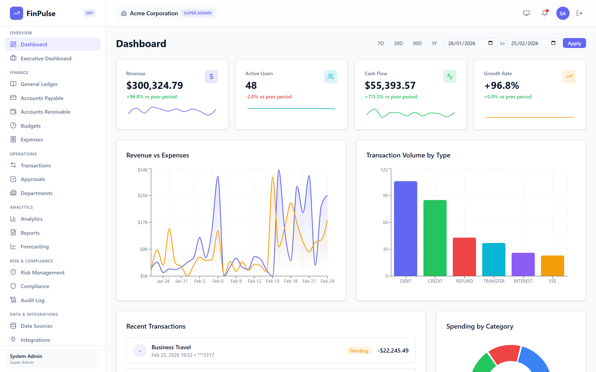
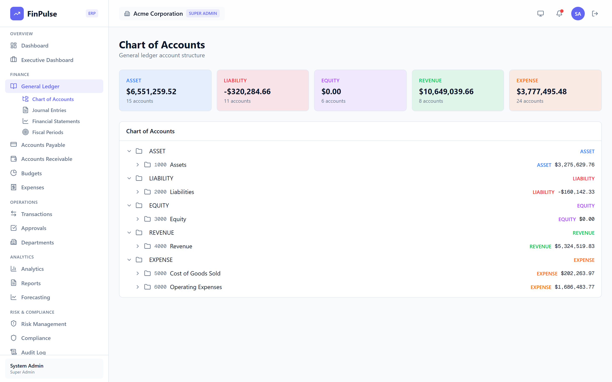
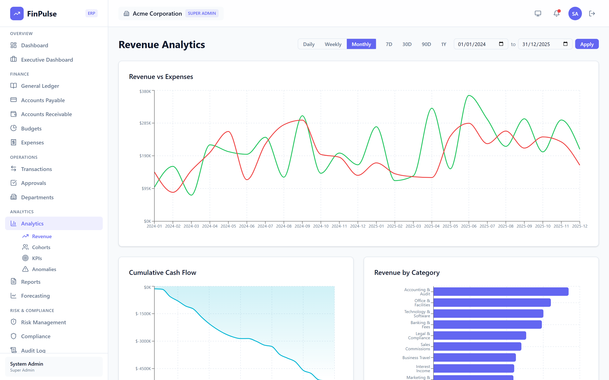
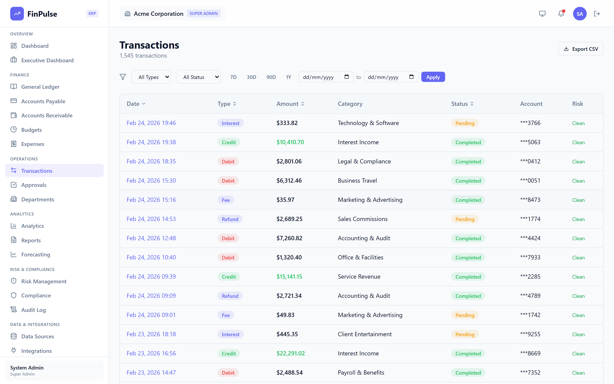
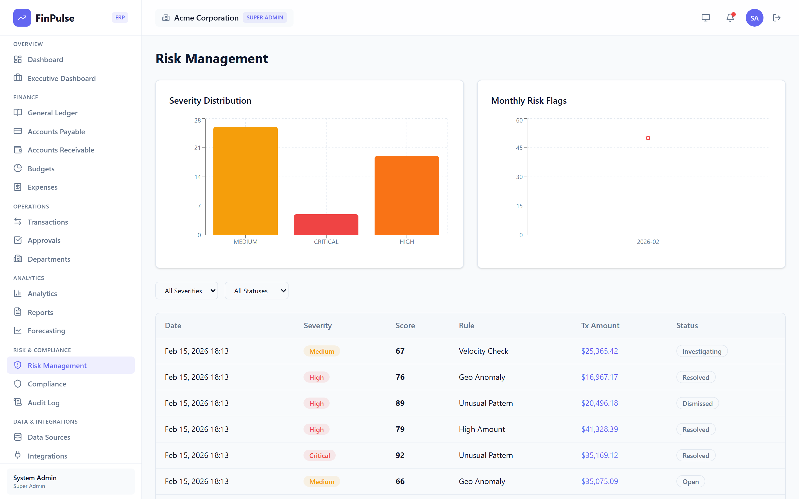
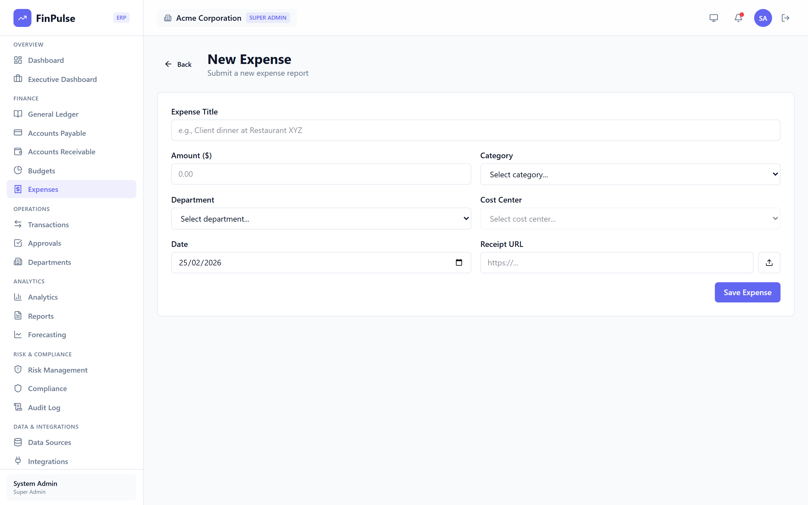

# FinPulse

**Enterprise Financial Management Platform** — A production-ready fintech application with ERP-grade accounting, real-time analytics, risk monitoring, and regulatory compliance.

[Live Demo](https://finpulse-ten.vercel.app) | [Report Bug](https://github.com/adeleke-taiwo/FinPulse/issues)

> **Demo Credentials:** Admin — `admin@acme.io` / `admin123` | User — `employee@acme.io` / `demo123`

---

## At a Glance

| Metric | Count |
|--------|-------|
| Pages | 60 |
| API Routes | 44 |
| Prisma Models | 35 |
| UI Components | 33 |
| Organizational Roles | 8 |

---

## Screenshots

| Dashboard | General Ledger |
|:---------:|:--------------:|
|  |  |

| Analytics | Transactions |
|:---------:|:------------:|
|  |  |

| Risk & Compliance | Expense Management |
|:-----------------:|:------------------:|
|  |  |

---

## Tech Stack

| Layer | Technology |
|-------|-----------|
| **Framework** | Next.js 16 (App Router) |
| **Language** | TypeScript 5.9 |
| **Frontend** | React 19, Tailwind CSS 4, Radix UI |
| **Charts** | Recharts 3 |
| **Auth** | NextAuth v5 (JWT + Credentials) |
| **Database** | Neon PostgreSQL (serverless) |
| **ORM** | Prisma 6 |
| **Validation** | Zod 4 |
| **Deployment** | Vercel |

---

## Features

### Accounting & Finance (ERP)
- **General Ledger** — Chart of accounts with drill-down into individual GL account activity
- **Journal Entries** — Double-entry journal with debit/credit line editor, approval workflow (Draft → Pending → Approved → Posted), and balance validation
- **Accounts Payable** — Vendor management, purchase invoices with multi-line items, tax calculation, and payment processing
- **Accounts Receivable** — Customer management, sales invoices, aging reports, and payment tracking
- **Budgets** — Department-level budget creation with GL account line items and utilization tracking
- **Financial Statements** — Auto-generated income statement, balance sheet, and trial balance
- **Fiscal Periods** — Configurable period open/close controls for accounting cycles
- **Forecasting** — Revenue and expense projections with trend analysis

### Analytics & Intelligence
- **KPI Dashboard** — Revenue, expenses, profit margins, cash flow metrics with auto-refresh polling
- **Revenue Analytics** — Trend analysis, growth rates, and segmentation
- **Cohort Analysis** — Customer and transaction cohort tracking
- **Anomaly Detection** — Automated flagging of unusual financial patterns
- **Custom Report Builder** — Configurable report templates with CSV export

### Risk & Compliance
- **Risk Monitoring** — Transaction risk scoring with severity distribution and drill-down
- **SOX Compliance** — Sarbanes-Oxley control tracking and monitoring
- **Segregation of Duties** — Role conflict detection and resolution
- **Audit Log** — Immutable trail with actor tracking, IP logging, and PII masking

### Expense Management
- **Expense Submission** — Multi-category expense tracking with receipt uploads and CSV import
- **Approval Workflows** — Configurable multi-step approval chains with policy violation detection

### Administration
- **Organization Management** — Multi-subsidiary support with separate entities
- **8 Organizational Roles** — Super Admin, CFO, Finance Manager, Department Head, Analyst, Employee, Auditor, External Accountant
- **Granular Permissions** — Module-level access control (view, create, edit, delete, approve, export)
- **Workflow Engine** — Visual approval workflow designer with step conditions

### Data & Integrations
- **Banking Connections** — Plaid-ready bank account integration
- **Crypto Data** — Cryptocurrency price tracking feeds
- **GitHub Integration** — Developer activity metrics
- **CSV Import/Export** — Bulk data operations with PapaParse processing
- **Scheduled Jobs** — Automated tasks via node-cron

---

## Architecture

```
src/
├── app/
│   ├── (auth)/              # Login & registration
│   ├── (dashboard)/         # 58 authenticated pages
│   │   ├── admin/           #   Organization, Members, Roles, Departments, Workflows
│   │   ├── analytics/       #   KPIs, Revenue, Cohorts, Anomalies
│   │   ├── compliance/      #   SOX, Segregation of Duties
│   │   ├── finance/         #   GL, AP, AR, Budgets, Journal, Statements, Periods
│   │   ├── expenses/        #   Submit, Track, Approve
│   │   ├── executive/       #   C-suite dashboard
│   │   ├── risk/            #   Risk monitoring
│   │   ├── transactions/    #   Transaction browser & detail
│   │   └── ...              #   Reports, Integrations, Data Sources, Settings
│   └── api/                 # 44 REST endpoints
├── components/              # 33 reusable components (UI, charts, finance, layout)
├── lib/
│   ├── auth/                # NextAuth config, permissions engine, org resolver
│   ├── db.ts                # Prisma client singleton
│   └── utils.ts             # Shared utilities
└── prisma/
    ├── schema.prisma        # 35 models, 21 enums
    ├── seed.ts              # Demo data seeder
    └── migrations/          # Version-controlled schema migrations
```

### Permission System

API-level enforcement via `requirePermission(module, action)`:

| Module | Available Actions |
|--------|-------------------|
| `gl`, `budgets`, `ap`, `ar` | view, create, edit, delete, approve |
| `transactions`, `expenses` | view, create, edit, export |
| `analytics`, `reports` | view, export |
| `compliance`, `risk` | view, manage |
| `admin` | view, manage, delete |

---

## Getting Started

### Prerequisites
- Node.js 18+
- PostgreSQL database (or [Neon](https://neon.tech) serverless)

### Setup

```bash
# Clone the repository
git clone https://github.com/adeleke-taiwo/FinPulse.git
cd FinPulse

# Install dependencies
npm install

# Configure environment
cp .env.example .env
# Set DATABASE_URL, NEXTAUTH_SECRET, NEXTAUTH_URL in .env

# Run database migrations and seed demo data
npm run db:setup

# Seed ERP data (GL accounts, vendors, customers, invoices)
npm run db:seed-erp

# Start development server
npm run dev
```

Open [http://localhost:3000](http://localhost:3000) to access the application.

### Scripts

| Command | Description |
|---------|-------------|
| `npm run dev` | Start development server |
| `npm run build` | Production build |
| `npm run start` | Start production server |
| `npm run lint` | Run ESLint |
| `npm run db:migrate` | Run Prisma migrations |
| `npm run db:seed` | Seed core data (users, accounts, transactions) |
| `npm run db:seed-erp` | Seed ERP data (GL accounts, vendors, customers, invoices) |
| `npm run db:setup` | Migrate + seed in one step |

---

## License

MIT

---

Built by [Adeleke Taiwo](https://github.com/adeleke-taiwo)
